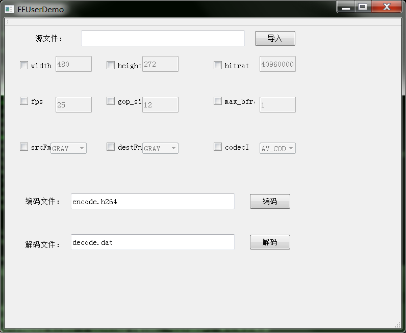

# FFMPEG 封装类 + 用例

为方便使用FFMPEG，封装成了如下的类。
类的用法也写在同一个工程里了。

    class FFUser : public QObject
    {
    	Q_OBJECT
    public:
    	FFUser();
    	~FFUser();

    	int initDecode(Params params);
    	int releaseDecode();

    	int initEncode(Params params);
    	int releaseEncode();

    	int decode(const unsigned char *buf,  int size);
    	int encode(const unsigned char *buf, int size);
    signals:
    	void encodeOneFrame(QByteArray data);
    	void decodeOneFrame(QByteArray data, int width, int height);
    private:
    	FFMPEG *decoder, *encoder;
    };

**示例:**

